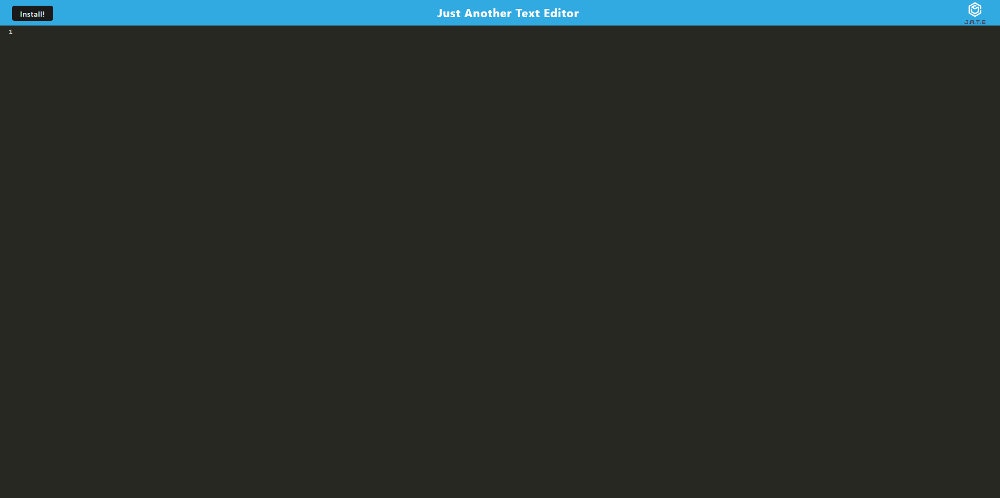
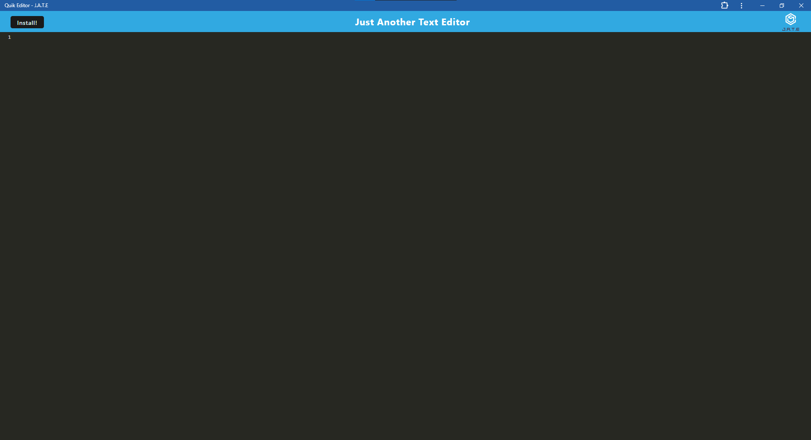

# Quik-Editor

### Description

A quik text editor as a pwa. You can use it in browser or as a web app.

## Table of Contents

- [Description](#description)
- [Installation](#installation)
- [Useage](#useage)
- [License](#license)
- [Contact](#Contact)

### Installation

Simply go to [Quik Editor](https://quik-editor.onrender.com/). Then press the install me button!

### Useage

Go to [Quik Editor](https://quik-editor.onrender.com/) and type whatever notes you want.

### License

Protected under the: MIT  [MIT](https://opensource.org/licenses/MIT)

### Contact

Author: Sven Salyard

Email: svensalyard@gmail.com

Github: [My Github](https://github.com/svensalyard)
